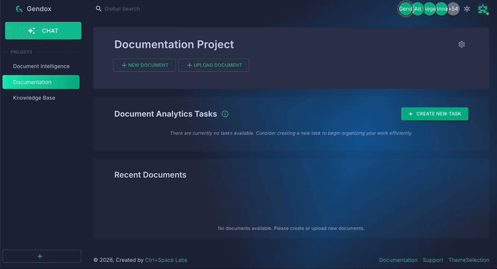
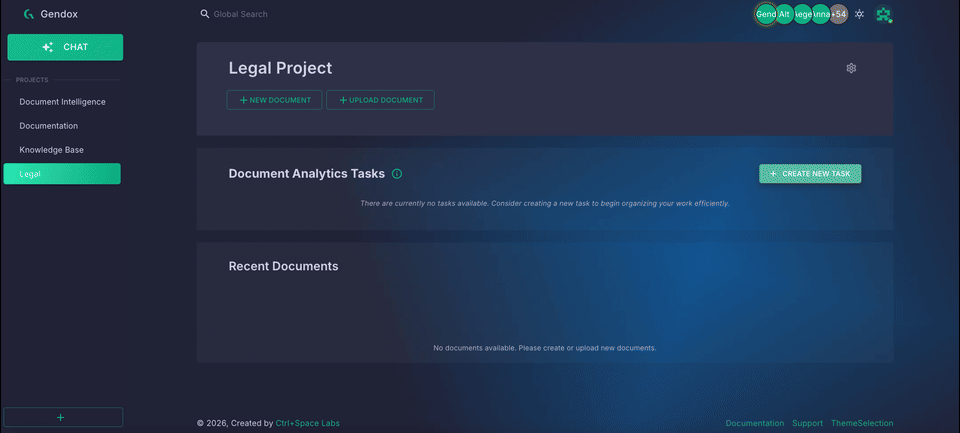

# Gendox — Build AI Agents from Your Data. Ship Them Anywhere.
**by** [Ctrl+Space Labs](https://www.ctrlspace.dev/)

**Gendox** is an open-source platform for building production-ready AI agents from your own data — and embedding them into any website with a single `<script>` tag. Upload your documents and Gendox handles chunking, embeddings, retrieval-augmented generation (RAG), tool calling, and an embeddable chat widget, so you can ship a knowledgeable AI assistant in minutes instead of building a RAG stack from scratch.

Fully open source and self-hostable (Spring Boot + Next.js + PostgreSQL/pgvector), with adapters for **OpenAI, Anthropic, Cohere, Groq, Gemini, Mistral, Ollama** and more.

> **Live demo:** [app.gendox.dev](https://app.gendox.dev) · **Docs:** [docs.gendox.dev](https://docs.gendox.dev)

---

## Main Features

### Upload Documents, Build RAG, and Chat with Your Agent

Upload PDFs, Word docs, spreadsheets, and text files; Gendox automatically splits and embeds them into a searchable pgvector knowledge base. Enable auto-training or click **Training** to create the embeddings, then open the **Chat** panel and ask questions — the agent answers using retrieval-augmented generation grounded in your content. The same agent and knowledge base power all the other features below.



[Read the setup guide →](documentation/docs/01-user-manual/setup-a-project.md)

---

### Set Up Agent Tools and Embed Your AI Agent on Any Website

Define tools with **OpenAI-style JSON schemas** (e.g. `open_web_page`, `set_filters`, `fill_form`) so the agent can trigger actions directly on your site. Then embed the ready-to-use chat widget with a single `<script>` tag — no framework required. Control it programmatically via `window.gendox.widget` and react to events via the `postMessage` API.

```html
<script
  id="gendox-chat-script"
  src="https://app.gendox.dev/gendox-sdk/gendox-widget-plugin.js"
  data-gendox-src="https://app.gendox.dev"
  data-organization-id="YOUR_ORG_ID"
  data-project-id="YOUR_PROJECT_ID">
</script>
```

<!-- Replace the placeholder below with a screen recording: add a tool in Settings → AI Agent → Tools, then show the widget on a sample page executing the tool. -->


[Widget installation guide →](documentation/docs/03-website-widget/01-website-widget-installation.md) · [Tool use & front-end actions →](documentation/docs/03-website-widget/02-agent-tool-use-and-website-tool-support.md)

---

### Document Insights

Upload a batch of documents, define the questions that matter to you, and let AI answer them across every document at once. Results appear in a **spreadsheet-style matrix** — one row per document, one column per question — with short answer values, detailed explanations, status flags (OK, Warning, Issue…), per-document summaries, and full **CSV export**.



[Document Insights guide →](documentation/docs/07-document-insights/01-document-insights.md)

---

### Document Digitization

Turn scanned PDFs and office files into clean, machine-readable output **page by page** using vision-capable LLMs — no traditional OCR needed. Add an optional **JSON schema (Structure)** to extract structured data in a single pass, then export all results to CSV. Supports PDFs, Word, Excel, PowerPoint, and more.

<!-- Replace the placeholder below with a screen recording: create a Document Digitization task, add a scanned PDF, run generation, preview per-page results, export CSV. -->


[Document Digitization guide →](documentation/docs/08-document-digitization/01-document-digitization.md)

---

## Technologies Used

### Backend
- **Spring Boot 3** — Java application framework
- **Java 25** — Virtual threads (structured concurrency)
- **Spring AI** — AI provider abstraction layer
- **Maven** — Build and dependency management

### Frontend
- **Next.js 15** — React framework (static export)
- **Material-UI 5** — Component library and theming
- **Redux Toolkit** — State management

### Database & Infrastructure
- **PostgreSQL 18 + pgvector** — Relational database with vector similarity search
- **Flyway** — Database schema migrations
- **Keycloak** — OAuth2/OIDC authentication

---

## Getting Started

The easiest way to run Gendox locally is with Docker Compose. All services — API, frontend, database, and Keycloak — start from a single command.

### Prerequisites

- [Docker](https://docs.docker.com/get-docker/) with Docker Compose

### Clone the Repository

```bash
git clone https://github.com/ctrl-space-labs/gendox-core.git
cd gendox-core
```

### Configure environment variables

An example environment file is committed at `gendox-compose-scripts/dev-ci-installation/env.local.example`. Copy it to `.env.local` in the same folder (`.env*` files are git-ignored so your secrets stay local):

```bash
cd gendox-compose-scripts/dev-ci-installation
cp env.local.example .env.local
```

The file contains working defaults for all infrastructure (database, Keycloak, ports), so the stack starts without any further changes. To get AI responses, open `.env.local` and set at least one provider key:

```bash
OPENAI_KEY=sk-...        # OpenAI
GROQ_KEY=gsk_...         # Groq (free tier available)
COHERE_KEY=...           # Cohere
# ANTHROPIC_KEY, GEMINI_KEY, MISTRAL_KEY, VOYAGE_KEY also supported
```

> The platform starts and the UI is fully usable without any AI key — you only need one when sending your first chat message.

### Start the stack

```bash
docker compose up -d
```

| Service | URL |
|---------|-----|
| Frontend | http://localhost:3000 |
| API | http://localhost:8080/gendox/api/v1 |
| Keycloak | https://localhost:8443 |
| Database | localhost:5433 |

For other environments see `gendox-compose-scripts/` (`build-ci-installation/`, `local-tests-installation/`).

---

## For AI Coding Assistants

If you are an AI coding agent (Cursor, Claude Code, OpenAI Codex, etc.) helping a developer integrate Gendox, use the Agent Skills at [docs.gendox.dev/skills/](https://docs.gendox.dev/skills/). Copy the relevant skill folder into `.agents/skills/` (Cursor/Codex) or `.claude/skills/` (Claude Code) in the consumer project. See the [AI coding assistants section in the docs](https://docs.gendox.dev/#for-ai-coding-assistants) for the full skill catalog and install instructions.

---

## Join the Community

Gendox is built in the open and contributions are very welcome.

### How to Contribute

Get in touch by sending an email to [contact@ctrlspace.dev](mailto:contact@ctrlspace.dev).

### Report Issues

Found a bug or have a suggestion? Please [create an issue](https://github.com/ctrl-space-labs/gendox-core/issues).

---

© [Ctrl+Space Labs](https://www.ctrlspace.dev/)
