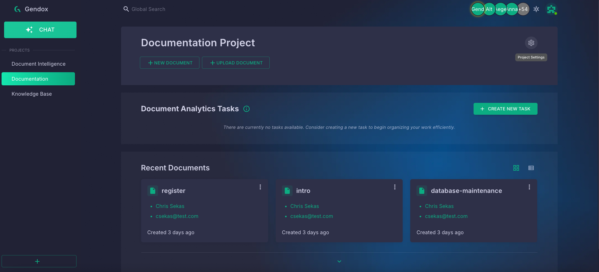
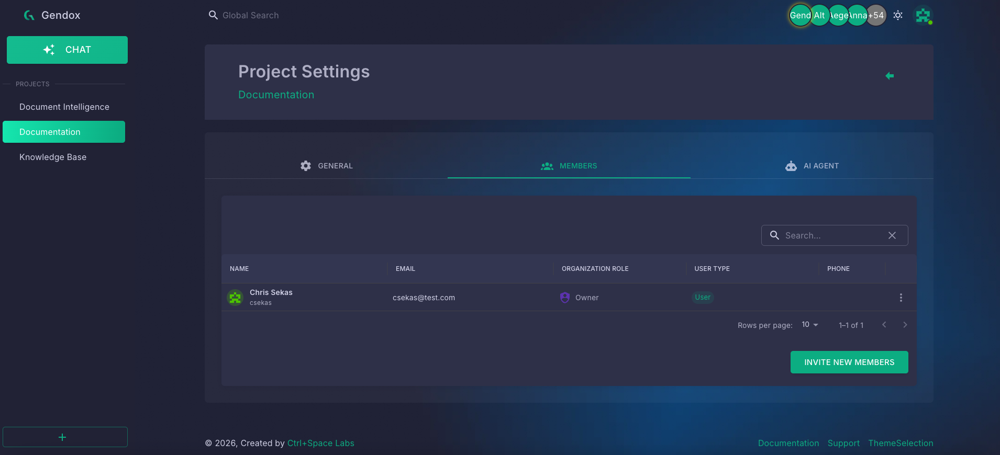
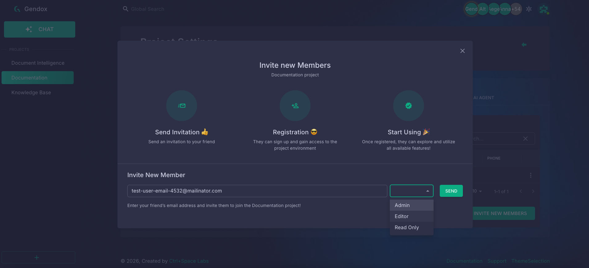
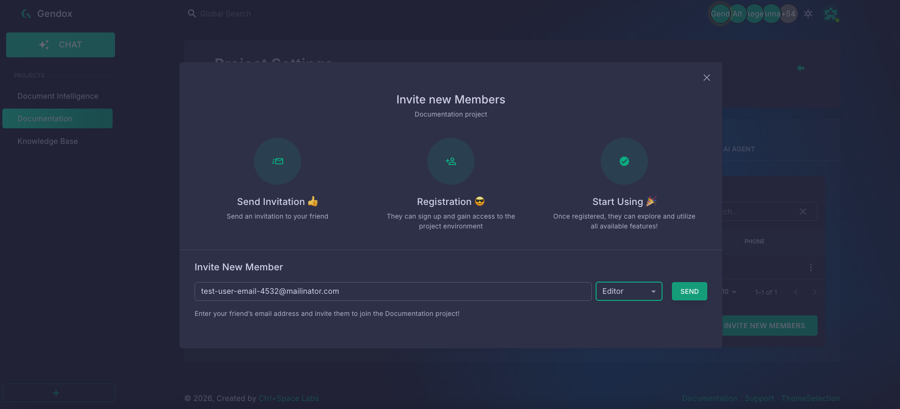
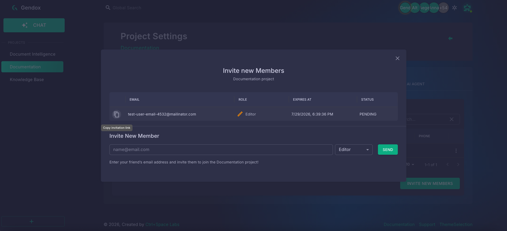
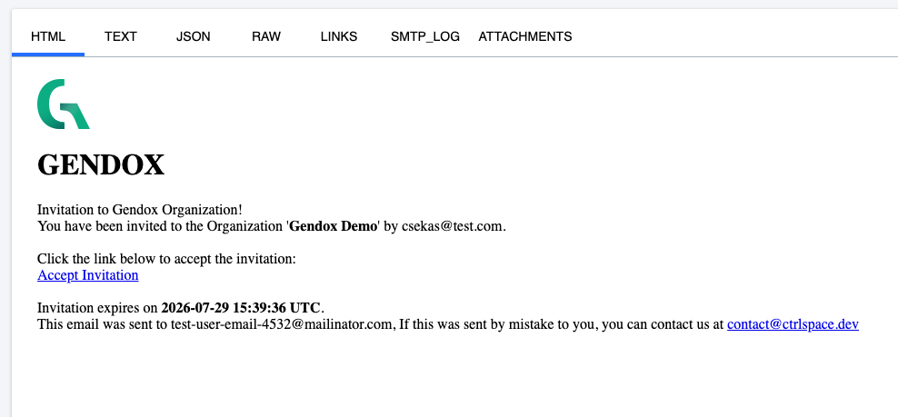

# Invite a user to your project

import inviteUserDemo from './img/invite-user/invite-user.gif';

You can invite teammates to collaborate on a Gendox project. The invited person receives an email with a link to join your organization and access the project you selected.

## Quick demo

> An invitation is valid for the **specific project** you invite them to, not the entire organization. To give someone access to multiple projects, send a separate invitation for each one.

---

## Open Project Settings

1. In the sidebar, select the project you want to share.
2. On the project page, click the **Project Settings** gear icon next to the project name.

---

## Go to the Members tab

1. In Project Settings, open the **MEMBERS** tab.
2. Review the current project members.
3. Click **INVITE NEW MEMBERS**.

---

## Send the invitation

1. In the **Invite new Members** dialog, enter the invitee's email address.
2. Choose a role from the dropdown:
   - **Admin** — can manage project settings and members
   - **Editor** — can create and edit documents
   - **Read Only** — can view project content without making changes
3. Click **SEND**.

After sending, the invitation appears in the list with a **PENDING** status and an expiration date. You can also copy the invitation link manually using the copy icon next to the email address.

---

## What the invitee receives

The invited person gets an email from Gendox with an **Accept Invitation** link. The link expires on the date shown in the email.

To complete onboarding, the invitee should click **Accept Invitation** and follow the steps in [Gendox Registration](./register.md#registration-via-invitation).
