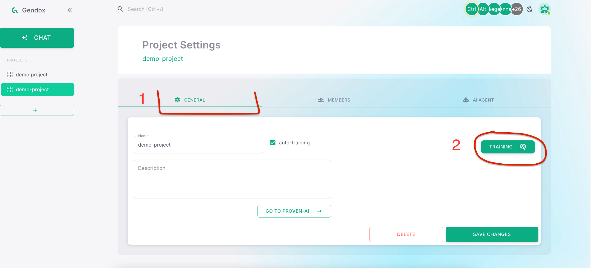

# Setup your first project

A Gendox Project combines two basic components:
- AI Agents
- A collection of files the agent learns from

An AI Agent is a virtual assistant that can help you, trained on the content you upload in each project.

---

## Create a new project

1. After your first login, Gendox will ask you to name your **Organization**. This is your main account — where you can also invite other users to collaborate.

2. You’ll then be prompted to create your **first project**. Just give it a name and click **SUBMIT** — you're ready to go!

3. Later, you can create additional projects anytime by clicking the **"+"** button in the sidebar:
   

4. In the sidebar, click the project's name to enter the project's page.

---

## Setup the AI Agent

An AI Agent is made up of:
- The underlying LLM
- Role/Behavior definition
- Knowledge (your uploaded files)

Each project comes with one AI Agent created automatically.

To configure the Agent:

1. Click the **Project Settings wheel** button in the project's page:
   

2. Go to the **Agent** tab

3. Select your preferred **LLM**

4. Describe the agent’s role in the **Agent Behavior** section

---

## Upload data

Gendox currently supports text files (e.g., `.txt`, `.md`) and PDFs. You can upload any file you want the agent to learn from.

1. In the project page, click the **Upload Documents** button:
   

2. Drag and drop your files, or click **Choose Files** to browse from your computer

3. Click **Upload** to upload them

---

## Train the AI Agent

1. In the **General** tab of your project, click the **Training** button

2. Wait a few minutes for training to complete

> 💡 If you are uploading files automatically through an API or integration, enabling **Auto Training** will re-train the agent every ~1 hour. You might want to disable this during the initial setup if you plan to upload many files in a short time.

---

## Chat with the agent

1. In the sidebar, click the **Chat** button

2. In the chat window, select the Agent or a previous thread

3. Start chatting!

