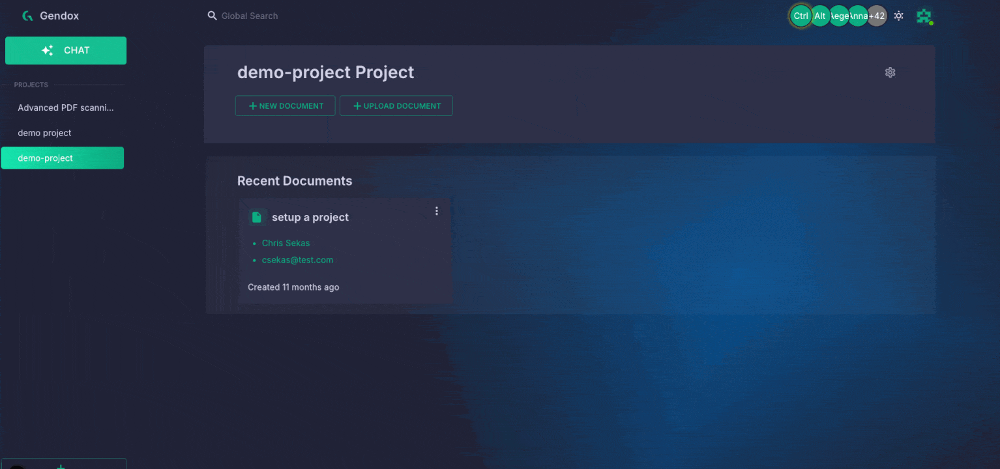

# Tool Use & Front-End Actions

## 1. What is “Tool Use”

Gendox supports a "tool use" mechanism that allows your AI agent to request actions on your website by calling tools that you define.  
Instead of just answering with text, the agent can, for example:

- Open a product page
- Apply or update search/filter options
- Auto-fill a form
- Trigger any custom front-end workflow

When a tool is triggered, the Gendox widget sends a browser `postMessage` event:

```json 
{
   "type": "gendox.events.chat.message.tool_calls.request",
   "payload": [...]
}
``` 
The event payload lists every tool call the agent just made, along with any arguments.


**Typical use cases:**

| Tool name        | What you implement in JS      | Example use-case                           |
|------------------|------------------------------|--------------------------------------------|
| `open_web_page`  | `window.open(url)`           | Open a new product page in a new tab       |
| `set_filters`    | Update DOM or URL parameters | Filter product listings                    |
| `fill_form`      | Fill input elements          | Speed-fill checkout or inquiry forms       |


## 3. Adding Tools in the Gendox UI

1. **Open your project** → **Settings** → **AI Agent** → **Tools**

2. Click **“Add Tool”** and paste a JSON schema identical to OpenAI’s format.

Example schema for “open web page”:

```json
{
  "name": "open_web_page",
  "strict": true,
  "description": "Function to open a web page in the browser. Sends an event to the browser to open a new tab with the specified URL.",
  "parameters": {
    "type": "object",
    "required": ["url"],
    "additionalProperties": false,
    "properties": {
      "url": {
        "type": "string",
        "description": "The URL of the web page to open"
      }
    }
  }
}
```

3. **Save**.  
   From now on your agent can decide to call `open_web_page`.

---

## 4. Handling Tool Calls in Your Front End

### 4.1 Add a listener

Gendox SDK is exposed in the browser under window.gendox.tools property. There are 3 important fields related to tool use:
```javascript
window.gendox.tools = {
  allTools: {
     "tool_name": handlerFunction,
     "other_tool_name": anotherHandlerFunction,
  }, // All tools defined in the project
   registerTool, // Function to register a new tool
   removeTool, // Function to remove a tool
};
```

Currently, there is 1 registered default tool: `open_web_page`, which opens a new tab with the specified URL. To add yours you can use the `registerTool` function:

```javascript
window.gendox.tools.removeTool('open_web_page'); // Remove existing tool if needed
window.gendox.tools.registerTool({
  name: 'open_web_page',
  handler: (args) => {
      // TODO add your implementation here
     console.log("Opening web page:", arguments.url);
     window.open(arguments.url, '_blank');
     return {"status": "executed"}
  }
});
```

Gendox SDK will automatically call the `handler` function when the agent calls the tool.   
If you to handle the tool calls in your own way, you can add a listener to the `message` event in the browser:

```javascript
window.addEventListener('message', (event) => {
  if (event.data.type === 'gendox.events.chat.message.tool_calls.request') {
    const toolCalls = event.data.payload;
    let responses = [];
    toolCalls.forEach((tool) => {
        if (tool.function.name === 'open_web_page') {
            // your implementation here
            // ----->>>>>  Add response message <<<<<-----
            tool.response = { status: "executed" };
        } 
        ...
      
    });
  }
});
```


:::warning
**Note:** Tool use is currently **one-way**: the agent **notifies the browser** to run a tool or action (e.g., open a page, update filters, etc.). Data **is not yet sent back to the agent**; this will be available in future versions.\
**Contact us** if you need this feature urgently!

:::

### 4.2  Payload format

The widget sends **an array** (you may receive multiple tool calls at once):

```json
[
  {
    "threadId": "2043baeb-873f-464a-8840-5bf32dd6856a",
    "messageId": "fe8244bf-ddc7-4ac8-9def-ff9f5163ae2f",
    "function": {
      "name": "open_web_page",
      "arguments": "{\"url\":\"https://example.com\"}"
    },
    "id": "",
    "type": "function"
  }
]
```

Field cheat-sheet:

| Field            | Meaning                                     |
|------------------|---------------------------------------------|
| `threadId`       | Chat thread the call belongs to             |
| `messageId`      | Specific message that triggered the call    |
| `function.name`  | Tool name you registered in Gendox          |
| `function.arguments` | JSON string with the parameters          |

---

## 5. Step-by-Step Recap

| Step | What you do                                                                                               |
|------|-----------------------------------------------------------------------------------------------------------|
| 1.   | Define tools in **Project → Settings → AI Agent → Tools** (OpenAI-style JSON schema).                     |
| 2.   | Deploy the usual Gendox widget `<script …>` tag on your site.                                             |
| 3.   | Add a `window.addEventListener('message', handler)` in your front-end.                                    |
| 4.   | In the handler, look for `type === 'gendox.events.chat.message.tool_calls.request'`.                      |
| 5.   | Parse `event.data.payload`, match each `function.name`, run your own JS (open tab, modify DOM, etc.).     |
| 6.   | (Future) In a later release you’ll be able to send results back to the agent.                             |

---

### 6. Gotchas & Best Practices

* **One-way only:** don’t expect a reply channel yet; perform the action and you’re done.
* **Security:** validate the arguments (`new URL(url)`, whitelists, etc.) before executing.
* **Multiple calls:** the array may contain more than one tool invocation—loop through it.
* **Versioning:** schema changes won’t break old widgets, but keep your handler switch-case up-to-date.

---

Happy building!  
With Gendox Tool Use you can turn any website from a static page into an interactive AI Agent that **navigates**, **filters**, and **controls** your site.
