# Gendox AI Agent - for WordPress Websites

import wpPluginDemo from './img/gendox-ai-agents-wp-installation.mp4';

The **Gendox WP AI Agent** plugin adds a Gendox chat widget to your WordPress site without
writing any code. Train an agent on the posts, pages and WooCommerce products you choose,
then the plugin shows the widget automatically on the pages you pick.

:::info
Get the plugin from
[github.com/ctrl-space-labs/gendox-ai-agent](https://github.com/ctrl-space-labs/gendox-ai-agent).
:::

<video controls autoPlay muted playsInline loop width="100%">
  <source src={wpPluginDemo} type="video/mp4" />
  Your browser does not support the video tag.
</video>

If you are integrating Gendox into a website that is **not** WordPress, see
[Website Widget Installation](./01-website-widget-installation.md) instead — that page
covers adding the widget `<script>` tag yourself.

## What the plugin does

- Adds a menu item, **Gendox AI Chat**, to your WordPress admin sidebar.
- Injects the chat widget on the front end, scoped to whichever post types and
  taxonomies you assign to a project.
- Exposes your posts, pages and products to Gendox so an agent can be trained on them.
- Embeds the Gendox app directly inside wp-admin so you can manage things without leaving
  WordPress.

## Install

1. In WordPress, go to **Plugins → Add New**, search for **Gendox WP AI Agent**, and
   install and activate it. (Or upload the zip from the
   [plugin's GitHub releases](https://github.com/ctrl-space-labs/gendox-ai-agent).)

   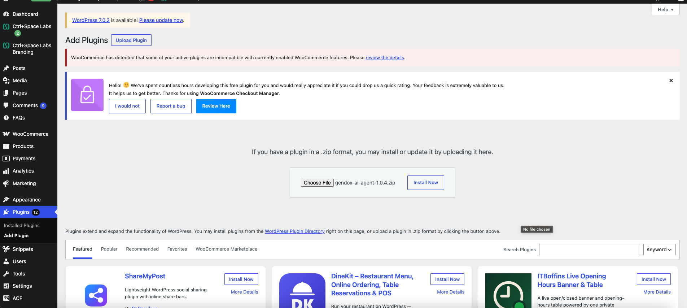

   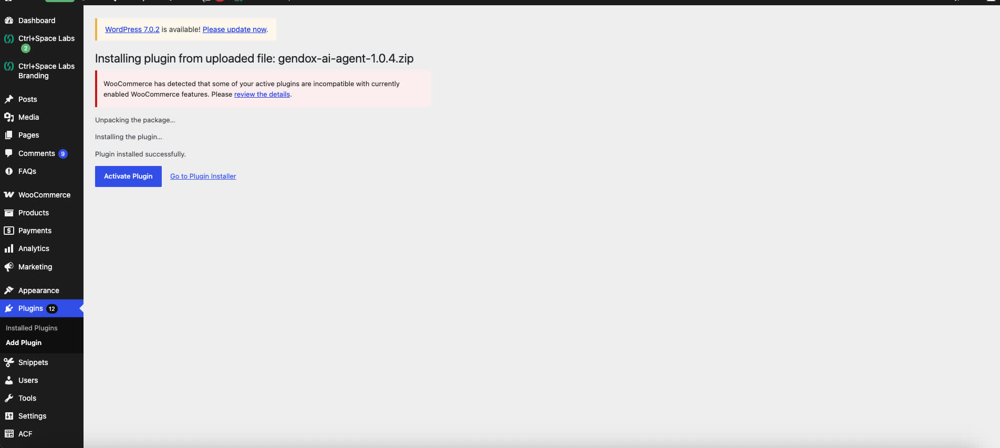

2. Create a Gendox account and project at [app.gendox.dev](https://app.gendox.dev) if you
   don't already have one.

   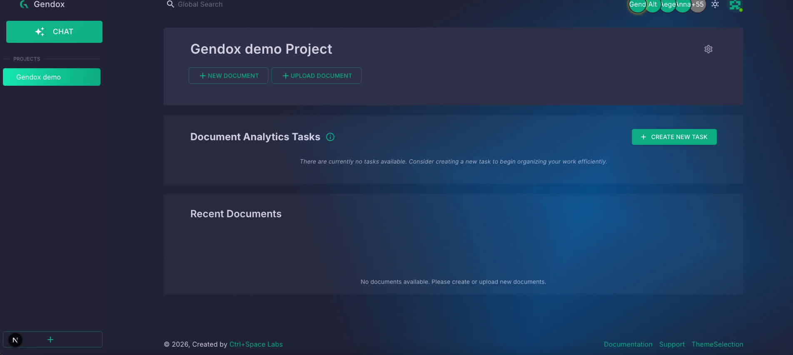

3. Train your agent, then enable it: project → **Settings → AI Agent** → set **Access** to
   **Public**.
   _(This step is crucial — the widget does not support authenticated end-users yet.)_

   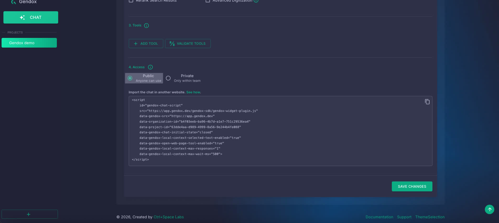

4. Copy your Gendox **API key** from the Gendox app: **Organization Settings → Advanced
   Settings → API Keys**.

   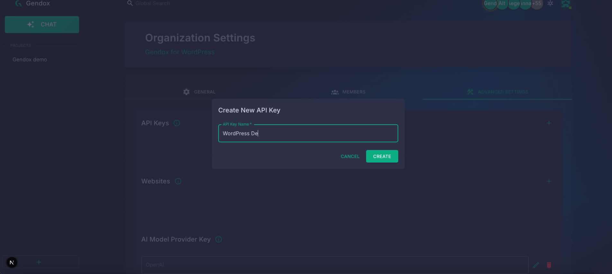

## Connect WordPress to Gendox

1. In WordPress, open **Gendox AI Chat → AI Chat Settings** and paste your API key.

   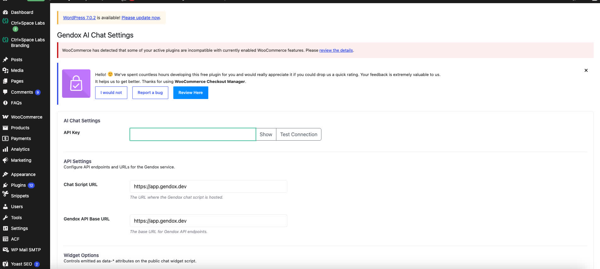

2. Click **Test Connection** to confirm it works.

   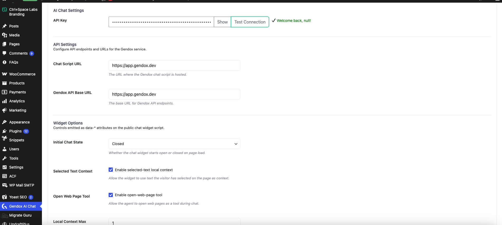

3. In the **Gendox Projects** section, click **Fetch Projects** to pull in your Gendox
   projects.

   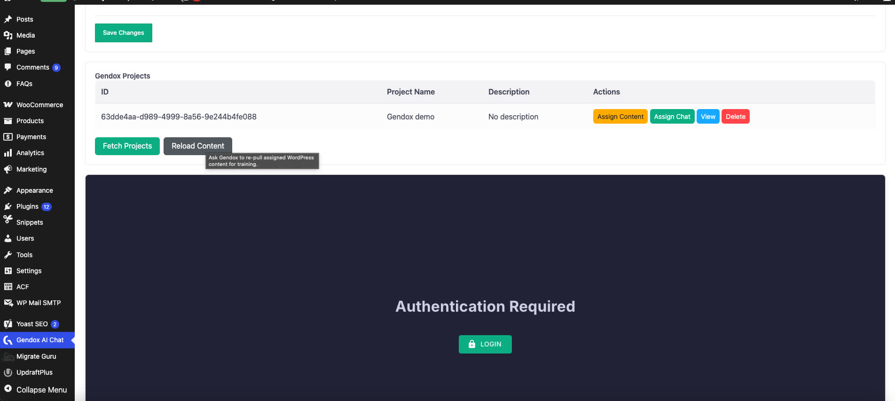

4. For each project:
   - **Assign Content** — choose which posts, pages, or products train that project's agent.

     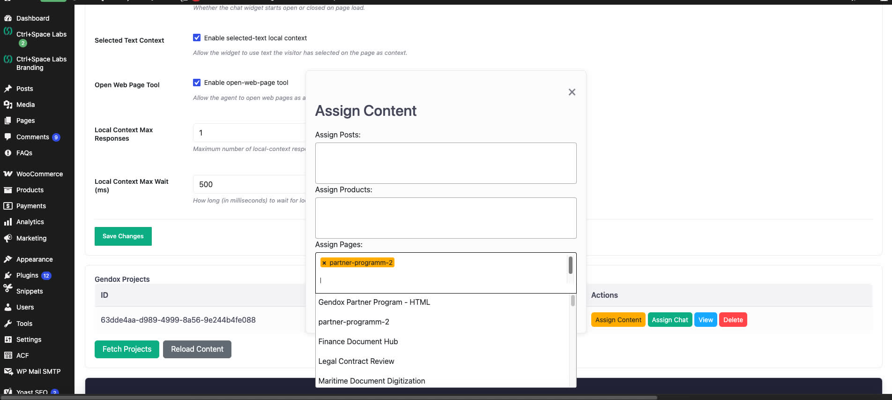

   - **Assign Chat** — choose which post types and taxonomies should display the widget.

     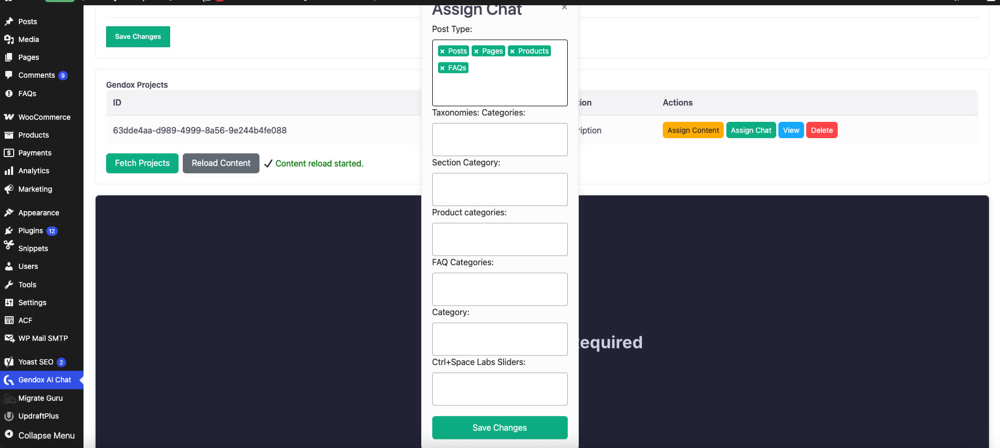

The chat widget then appears automatically on matching pages — there's nothing to paste
into a theme or page builder.

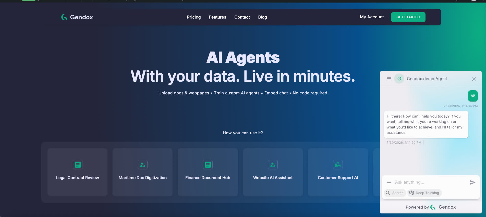

## Self-hosted Gendox

If you run your own Gendox instance rather than using `app.gendox.dev`, set your instance's
URL under **API Settings** on the same page (**Chat Script URL** and **Gendox API Base
URL**).

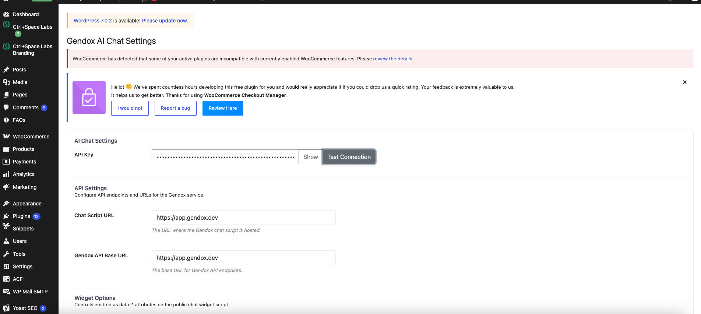

## For developers

Registering custom [local context](./02-agent-tool-use-and-website-tool-support.md) or
browser tools works a little differently on WordPress than on a generic site, because the
plugin injects the widget script for you rather than you adding it yourself.

### Agent skills

If you are using an AI coding assistant (Cursor, Claude Code, OpenAI Codex, etc.), copy the
relevant skill from <a href="/skills/" target="_self">/skills/</a> into your project
(`.agents/skills/` or `.claude/skills/`) and invoke it from chat:

| Skill | Use when |
|-------|----------|
| <a href="/skills/gendox-wordpress-integration/SKILL.md" target="_self">gendox-wordpress-integration</a> | Setting up the WP plugin, or registering tools / local context on WordPress |
| <a href="/skills/gendox-widget-integration/SKILL.md" target="_self">gendox-widget-integration</a> | Embedding the widget or wiring tools / local context on a non-WordPress site |

Also see the plugin's own
[README](https://github.com/ctrl-space-labs/gendox-ai-agent#readme).

## Related

- [Website Widget Installation](./01-website-widget-installation.md) — for non-WordPress sites
- [Agent Tool Use and Website Tool Support](./02-agent-tool-use-and-website-tool-support.md)
- [Widget Programmer Guide](./03-widget-programmer-guide.md)
- <a href="/skills/" target="_self">Agent Skills catalog</a> — portable skills for AI coding assistants
