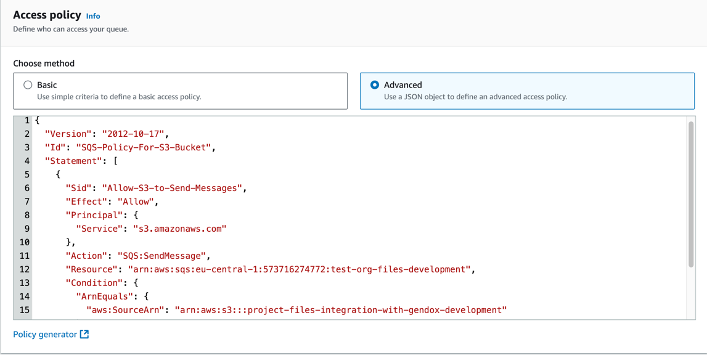
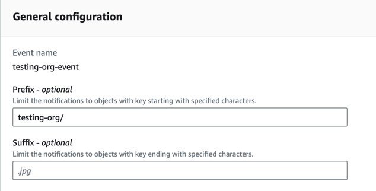
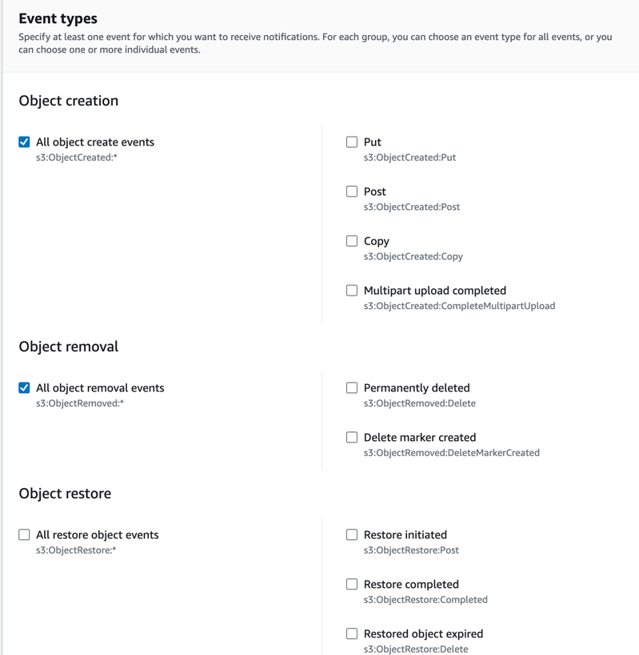

# Integration AWS S3 Bucket Configuration

This guide outlines the steps to set up an AWS S3 bucket, create an SQS queue with the necessary permissions, configure S3 bucket event notifications, and set up the database to connect the bucket with a project.

## 1. Create an S3 Bucket and Folder

### Step 1: Create an S3 Bucket
1. Log into your AWS Management Console.
2. Navigate to the **S3** service.
3. Click **Create bucket**.
4. Enter a unique **Bucket name** (e.g., `project-files-integration-with-gendox-development`).
5. Select the appropriate **AWS Region** (e.g., `eu-central-1`).
6. Configure other settings as needed (versioning, encryption, etc.).
7. Click **Create bucket** to finalize.

### Step 2: Create a Folder in the S3 Bucket
1. Once the bucket is created, go to the **Buckets** list and click on your newly created bucket.
2. In the **Objects** tab, click **Create folder**.
3. Enter a **Folder name** (e.g., `project-files-integration-with-gendox-development`).
4. Set any necessary permissions and configurations, and click **Create folder**.

## 2. Create an SQS Queue with Access Policy

### Step 1: Create the SQS Queue
1. Go to the **SQS** service in the AWS Management Console.
2. Click **Create Queue**.
3. Choose the **Standard** type.
4. Enter a **Queue Name** (e.g., `test-org-files-development`).
5. Add Access policy to the queue to allow S3 to send messages to the queue. Here is an example policy:

```json
{
  "Version": "2012-10-17",
  "Id": "SQS-Policy-For-S3-Bucket",
  "Statement": [
    {
      "Sid": "Allow-S3-to-Send-Messages",
      "Effect": "Allow",
      "Principal": {
        "Service": "s3.amazonaws.com"
      },
      "Action": "SQS:SendMessage",
      "Resource": "arn:aws:sqs:eu-central-1:573716274772:test-org-files-development",
      "Condition": {
        "ArnEquals": {
          "aws:SourceArn": "arn:aws:s3:::project-files-integration-with-gendox-development"
        }
      }
    }
  ]
}
```

6. Configure other settings if needed, then click **Create Queue**.

## 3. Configure S3 Bucket Event Notification

1. Go to your **S3** bucket (`project-files-integration-with-gendox-development`) in the AWS Management Console.
2. Navigate to the **Properties** tab.
3. Scroll down to **Event notifications** and click **Create event notification**.
4. Enter a **Name** for the notification (e.g., `test-event`).
5. In the **Prefix** field, enter the folder name (e.g., `project-files-integration-with-gendox-development/`).
   
6. In **Event types**, select the events to trigger notifications:
    - **All object create events**
    - **All object removal events**
    
7. Under **Destination**, choose **SQS Queue**.
8. Put you SQS queue ARN in the **SQS queue** field.
8. Click **Save changes** to finalize the event notification setup.

## 4. Database Configuration

To finalize the integration, set up a record in your database to connect the project with the S3 bucket and SQS queue.

### Step-by-Step Database Setup
1. Insert a new record in the `integrations` table in your database.
2. Set the following fields:
    - **project_id**: The ID of the project that will use this integration.
    - **type_id**: ID that corresponds to the integration type (e.g., S3).
    - **is_active**: Set to `true` to activate the integration.
    - **queue_name**: Name of the SQS queue (`test-event`).

Example SQL statement:

```sql
INSERT INTO gendox_core.integrations (project_id, type_id, is_active, queue_name)
VALUES ('<your-project-id>', '<s3-type-id>', true, 'test-event');
```

Replace `<your-project-id>` and `<s3-type-id>` with the correct values.

---
