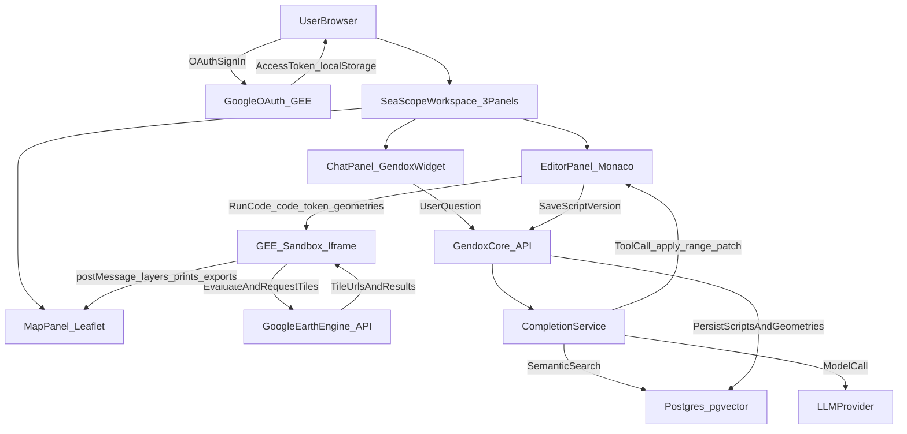

import architectureIllustration from './img/SeaScope - Architecture illustration.png';

# Architecture & Data Processing

SeaScope (Earth Observation) is a browser-first Earth Engine workspace where:

- The **AI agent** helps you write/modify a GEE JavaScript script.
- The script is executed **client-side** in a sandboxed iframe.
- The **map** displays results as Earth Engine tile layers.
- The backend provides **persistence** for scripts and geometries, plus the broader Gendox AI/semantic-search system used by the agent.

---

## High-level system diagram

---

## GEE authentication and session lifecycle

SeaScope uses the Earth Engine JavaScript client (`@google/earthengine`) in the browser to:

- start OAuth sign-in,
- store the **access token** locally,
- and initialize the EE runtime for session readiness checks.

**Key properties:**

- The access token is stored in `localStorage` (per browser/profile).
- A banner is shown when the session is expired, and the user can reconnect.
- The token is used for:
  - executing scripts inside the sandbox iframe,
  - fetching Earth Engine image/thumbnail responses (authorized fetch).

---

## The GEE sandbox: why an iframe

SeaScope executes Earth Engine JavaScript in a **hidden iframe** (`public/gee-sandbox/gee-sandbox.html`).

This design provides:

- **Isolation**: separates the EE evaluation environment from the main UI runtime.
- **A strict message protocol**: the iframe returns only structured data (layers, prints, exports).
- **Recoverability**: SeaScope can re-mount a fresh iframe per run (new `iframeKey`) for clean state.

The iframe loads EE libraries and exposes a controlled `Map` proxy that translates user code effects into `postMessage` events for the parent.

---

## Sandbox message protocol (parent ↔ iframe)

SeaScope communicates with the sandbox using `window.postMessage` (parent ↔ iframe).

### Parent → Iframe

- **`EXECUTE`**: run the provided code with `{ token, geometries }`.
- **`GEE_FETCH_OPERATION`**: poll an export/operation by name or id.
- **`CANCEL_EXPORT`**: request cancellation of a running operation.
- **`GET_THUMB`**: request a thumbnail/screenshot capture of the current map result.

### Iframe → Parent

- **`IFRAME_READY`**: sandbox initialized and ready to execute.
- **`SUCCESS`**: script ran; includes newly-added layer(s) and metadata.
- **`ERROR`**: execution error payload.
- **`PRINT`**: a `print()` message emitted by the script.
- **`CENTER`**: request map center/zoom updates.
- **`ZOOM`**: request zoom to bounds/geometry.
- **`CLEAR_LAYERS`**: request removal of current overlays.
- **`MAP_OPTIONS`**: map configuration changes.
- **`THUMBNAIL`** / **`SCREENSHOT`**: capture result; parent may fetch bytes via authorized HTTP.
- **`EXPORT_STARTED`**: an export/operation was started by the script.
- **`GEE_OPERATION_RESULT`**: polling result for an operation (used to update status UI).

---

## AI agent loop (semantic search → code patch)

On the backend, `CompletionService` runs a tool-calling loop:

- It assembles a message list (system prompt + conversation + tool results).
- It calls a model provider (OpenAI/Anthropic/etc.).
- If the model returns **tool calls**, the backend executes supported tools and appends tool results back to the conversation context.

For SeaScope, the most important outcome is **code editing**:

- The agent produces a patch tool call (e.g. `apply_range_patch`) targeting the editor content.
- The frontend applies the patch to the Monaco editor (the script buffer).

### What context the agent can use

SeaScope can provide agent-visible context such as:

- current script (as a “file”),
- recent print logs,
- drawn geometries (AOIs),
- optionally, screenshots/thumbnail images (when wired into chat contexts).

---

## Persistence model (backend)

SeaScope persists only what must survive sessions:

### `EOScript` (versioned scripts)

- Stored as text (`scriptContent`) and metadata (title, description).
- A “latest version” flag is maintained, and identical content is de-duplicated (no new version created if unchanged).

### `EOTaskGeometry` (AOIs)

- Stored as JSONB coordinates with a type (polygon/point/etc.) and display order.
- Used as inputs to scripts via the `geometries[]` runtime array.

### REST API surface

The backend exposes EO-specific endpoints under:

`/organizations/{organizationId}/projects/{projectId}/tasks/{taskId}/earth-observation`

- `GET/POST /eo-scripts`
- `GET /eo-scripts/latest`
- `GET/POST /eo-geometries`
- `PUT/DELETE /eo-geometries/{geometryId}`
- `DELETE /eo-geometries` (bulk)

---

## Workspace layout architecture (frontend)

SeaScope uses a 3-panel grid:

- Map (Leaflet)
- Editor (Monaco)
- Chat (Gendox Widget iframe)

Panels are **always mounted** to avoid expensive remounts:

- layout changes (maximize/minimize/split ratios) are applied via CSS,
- state is kept in a dedicated Redux slice (`src/store/earthObservation/`).

---

## Chat widget bridge (frontend)

SeaScope embeds the Gendox chat as a widget (iframe + injected script).

The `ChatPanel` bridges the widget to the workspace by providing:

- **local context providers** (script text, logs, geometries),
- **tool handlers** (patching the editor, triggering run, etc.),
- shared refs (`panelState`) so chat can access editor/run/map behaviors without prop drilling.

