# Document Insights

import documentInsightsDemo from './img/document-insights/document-insights.gif';

**Document Insights** lets you upload a batch of documents, define the questions you care about, and use AI to extract answers across every document at once. Results appear in a **spreadsheet-style matrix** — one row per document, one column per question — with status flags, detailed explanations, per-document summaries, and CSV export.

## Quick demo

---

## Example: Contract review

This walkthrough cross-checks **two signed contracts** against a **template contract** and runs a separate legal review on each document.

You will:

1. Create a Document Insights task.
2. Define two questions — one for template comparison, one for legal review.
3. Attach the template as a supporting document.
4. Upload the two contracts.
5. Add per-document context (optional).
6. Generate answers and inspect the results.

---

### Create the task

1. Open your project and click **CREATE NEW TASK** on the project home page.
2. Choose **Get insights from multiple documents**.
3. Name the task (for example, **Contract Review**) and click **CREATE**.

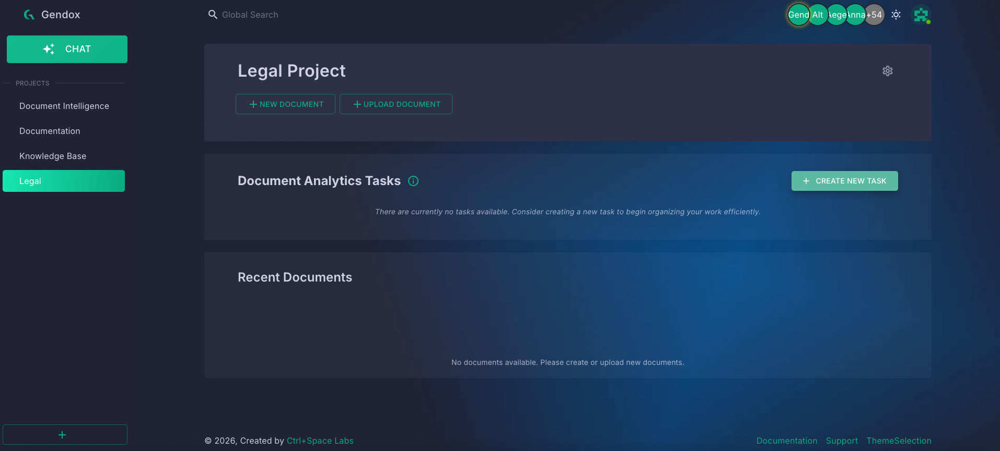

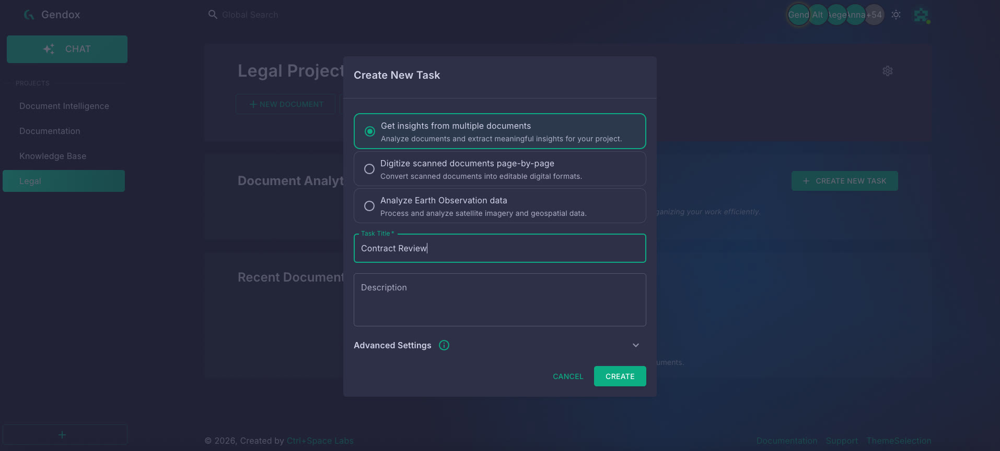

---

### Define questions

Click **ADD QUESTIONS** to open the questions panel. Each question becomes a **column** in the insights grid.

In this example we add two questions:

| Column | Purpose |
|--------|---------|
| **Template** | Cross-check each contract against the template and report deviations (amounts, removed terms, new terms, updated terms). |
| **Review** | Review the contract for unfavourable terms, missing clauses, and items that should be updated. |

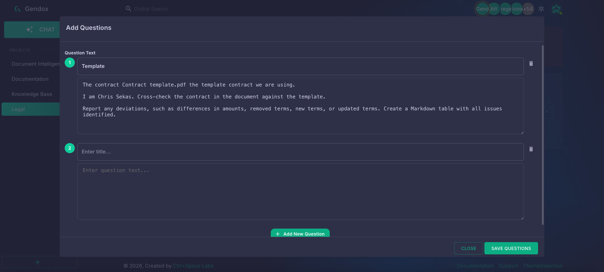

For the **Template** question, attach the template contract as a **supporting document** so the AI can reference it during analysis. Click **ADD DOCUMENT** inside the question editor, select or upload `Contract template.pdf`, then click **SAVE**.

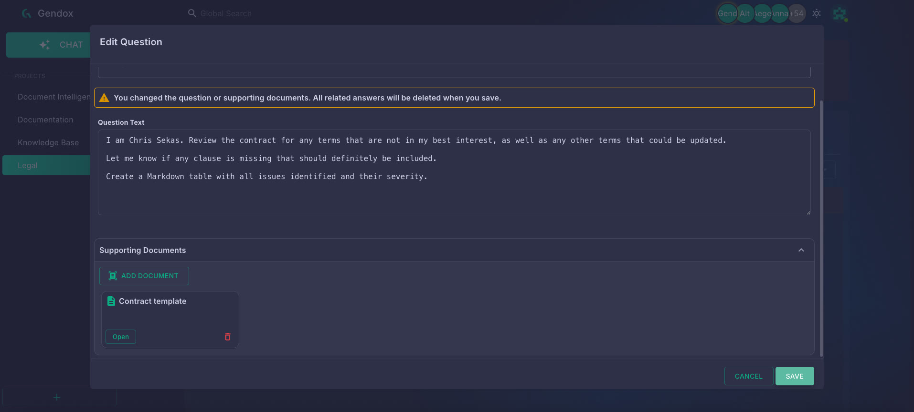

Click **SAVE QUESTIONS** when you are done.

---

### Upload documents

Click **ADD DOCUMENT** and upload the contracts you want to analyse. In this example we upload two PDFs:

- `DevOps Webinar.pdf`
- `GenAI for Developers.pdf`

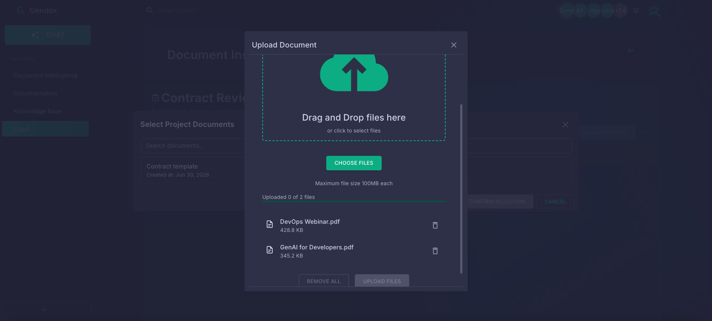

Each uploaded document becomes one **row** in the insights grid. Supported formats include PDF, Word (`.docx`/`.doc`), Excel (`.xlsx`/`.xls`), PowerPoint (`.pptx`), plain text, and more.

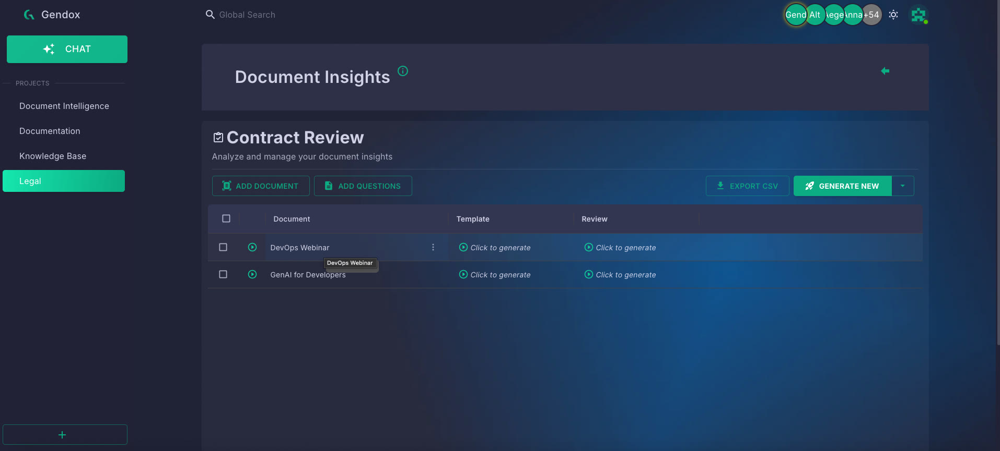

---

### Add per-document context (optional)

Click a document name to open its detail panel. Use the **Prompt** field to add document-specific instructions — for example, agreed changes that differ from the template:

> This is for 15 hours.
> It will start at 13/6/2026.

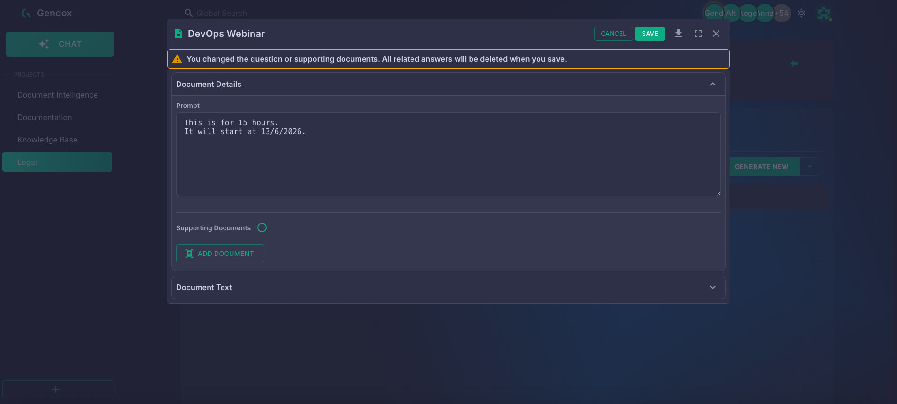

Saving changes to a document prompt or its supporting files will clear existing answers for that document.

---

### Run generation

Click **GENERATE NEW** and confirm in the dialog. Gendox fills only cells that do not have an answer yet — existing content is not overwritten.

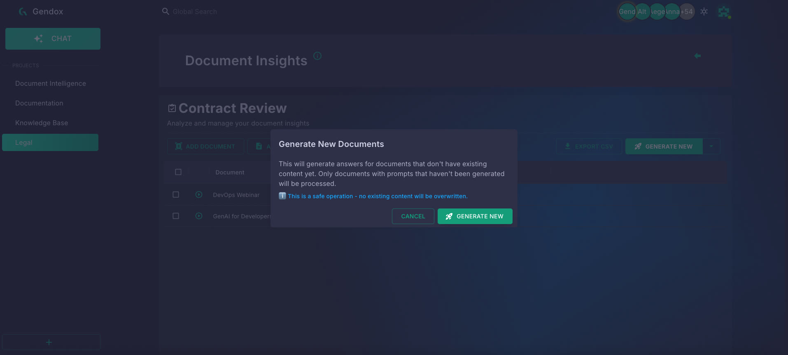

Generation runs as a background batch job. A progress indicator appears while it is running; click **Stop** to cancel early.

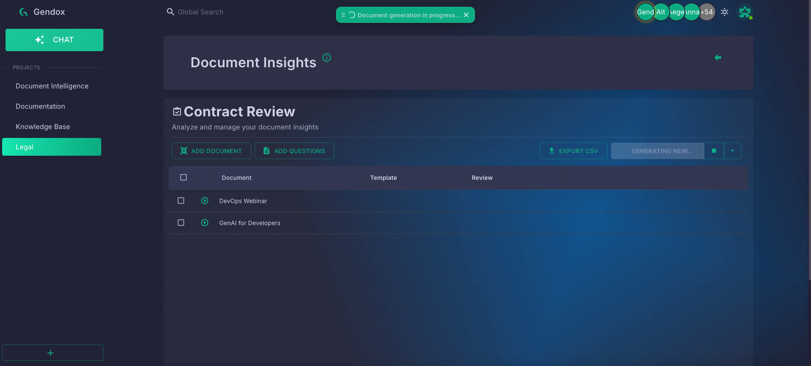

You can also use the **Generate** dropdown for other modes:

| Mode | Behaviour |
|------|-----------|
| **Generate New** | Fill only cells that have no answer yet. |
| **Generate All** | Regenerate all cells (overwrites existing answers). |
| **Generate Selected** | Regenerate answers only for the checked documents. |

Click an individual cell to regenerate a single answer.

---

### Read results

When generation completes, each cell shows a short answer, a colour-coded status flag, and a detailed explanation.

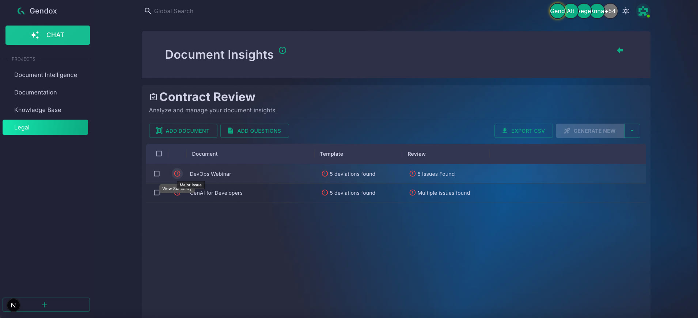

In our example:

- The **Template** column reports deviations found against the template (for example, *5 deviations found*).
- The **Review** column reports legal review findings (for example, *5 Issues Found* or *Multiple issues found*).

Hover a status flag and click **View Summary** to open the consolidated findings for that document.

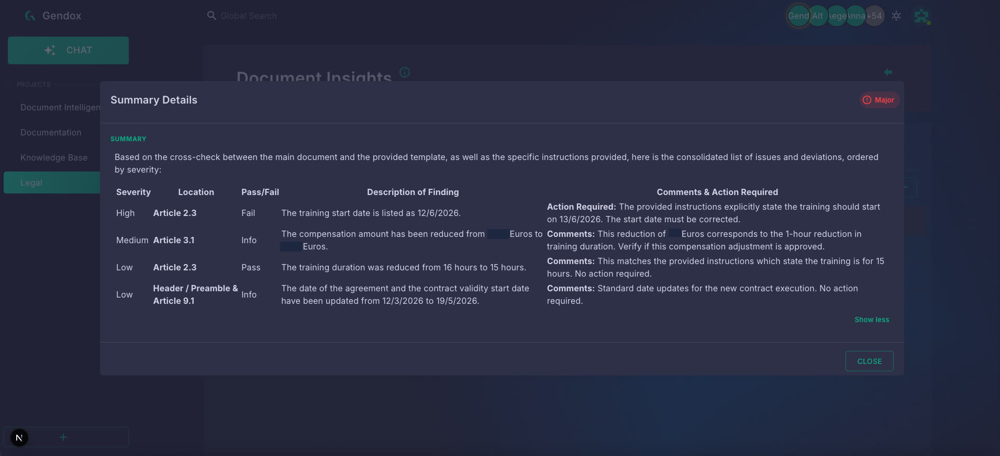

Each cell in the grid contains:

- **Answer Value** — a short, concise answer.
- **Description** — a detailed markdown explanation (click the cell to expand).
- **Status flag** — a colour-coded indicator:

| Flag | Meaning |
|------|---------|
| Info | Informational finding, no action required. |
| OK | Positive / compliant result. |
| Warning | Potential issue worth reviewing. |
| Minor Issue | Small problem identified. |
| Major Issue | Significant problem found. |
| Critical Issue | Serious non-compliance or risk. |
| N/A | Question not applicable to this document. |

Click the summary icon in the first column of a document row to view or regenerate its **overall document summary**.

---

### Export to CSV

Click **EXPORT CSV** in the header to download the full matrix. You can also export results for a single document from the document detail panel.

---

## Tips

- Add a **task prompt** (in task settings → Advanced Settings) to guide all AI answers with shared context or instructions.
- Attach **supporting documents** to individual questions when the question requires reference material that is not in the document being analysed — as we did with the contract template on the Review question.
- Use **Generate Selected** after editing a question to refresh only the affected rows without re-running the entire batch.
- Reorder questions by dragging them in the questions panel.
