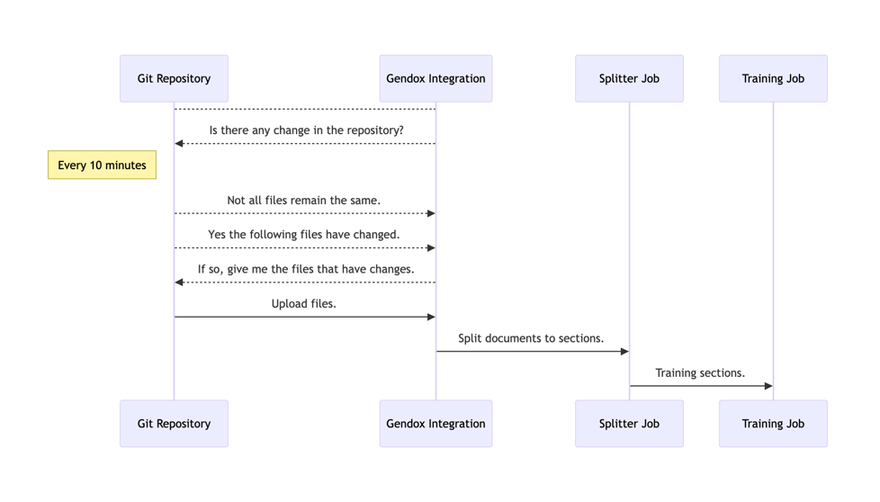
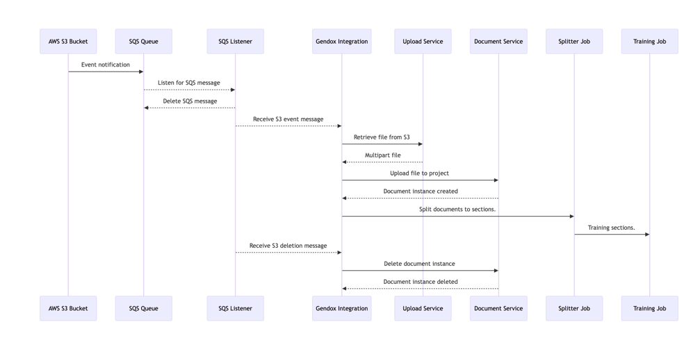

# Gendox Integration

## Overview

- Gendox's integration feature facilitates seamless interaction with various external platforms like GitHub, Dropbox, Google Drive, and AWS S3. This documentation provides a comprehensive guide on how to utilize these integrations, focusing particularly on the Git integration.
- The Gendox integration feature is implemented through a combination of database configurations, Spring Boot services, and integration patterns. It facilitates the management of external integrations, focusing primarily on handling file updates and synchronization.

## 1. Introduction

Gendox's integration feature is designed to enhance project management and document handling by connecting Gendox with various third-party services. This feature allows users to import, export, and synchronize files seamlessly.

## 2. Supported Integrations

| Integration Type         | Description                                                  |
|--------------------------|--------------------------------------------------------------|
| Git Integration          | Connects a Gendox project with a Git repository for automatic synchronization of changes. |
| Dropbox Integration      | Links Gendox with a Dropbox account, enabling file sharing and management directly from Gendox. (Not available yet) |
| Google Drive Integration | Connects Gendox with a Google Drive account for accessing and managing Google Drive files within Gendox. (Not available yet) |
| AWS S3 Integration       | Facilitates interaction with AWS S3 buckets, allowing users to manage S3 files from Gendox. |

### 2.1 Git Integration
- Connects Gendox projects with Git repositories.
- Facilitates automatic synchronization of changes.
- Utilizes Spring Integration for handling Git events.

### 2.2 Dropbox Integration (not available yet)
This integration links Gendox with a Dropbox account, allowing file sharing and management directly from Gendox.

### 2.3 Google Drive Integration (not available yet)
Connect Gendox with a Google Drive account for accessing and managing Google Drive files within Gendox.

### 2.4 AWS S3 Integration
This integration facilitates the interaction with AWS S3 buckets, allowing users to manage S3 files from Gendox.

## 3. Configuration and Usage

### 3.1 Setting Up Integrations

- 1. Choose Integration Type: Select the desired integration type (Git, Dropbox, Google Drive, or AWS S3).
- 2. Enter Credentials: Provide the necessary authentication details like URL, directory path, and access credentials.
- 3. Activate Integration: Enable the integration to start synchronization.

### 3.2 Git Integration Workflow

- 1. Repository Connection: Connect a Gendox project with a Git repository.
- 2. Automatic Pull: Gendox periodically checks for updates in the Git repository.
- 3. File Synchronization: Updated files are pulled into the Gendox project.
- 4. Upload and Version Control: Changes made in Gendox can be pushed back to the Git repository.

## 4. Understanding Gendox Integration Code

### 4.1 Database Setup

- **Types Table:** Stores integration types (GIT, Dropbox, etc.).
- **Integrations Table:** Holds details about each integration, such as type, project ID, and repository information.

### `integrations` Table Layout

| Column           | Data Type | Description                                     |
|------------------|-----------|-------------------------------------------------|
| id               | UUID      | Primary key for the integration                 |
| project_id       | UUID      | ID of the associated project                    |
| type_id          | UUID      | Type of integration (e.g., GitHub, S3, etc.)    |
| is_active        | Boolean   | Indicates if the integration is active          |
| url              | String    | URL of the repository or service                |
| queue_name       | String    | Queue name for S3 integration                   |
| directory_path   | String    | Directory path for GitHub or other integrations |
| repository_head  | String    | Head commit for GitHub integration              |
| user_name        | String    | Username for integrations requiring auth        |
| password         | String    | Password for authenticated integrations         |
| created_at       | Timestamp | When the integration was created                |
| updated_at       | Timestamp | When the integration was last updated           |
| created_by       | UUID      | ID of the user who created the integration      |
| updated_by       | UUID      | ID of the user who last updated the integration |

#### Required Columns by Integration Type

| Integration Type | Required Columns                                  |
|------------------|---------------------------------------------------|
| **GitHub**       | `type_id`, `project_id`, `is_active`, `url`, `directory_path`, `repository_head`, `updated_at` |
| **S3**           | `type_id`, `project_id`, `is_active`, `queue_name` |
| **Dropbox**      | `type_id`, `project_id`, `is_active`, `url`, `directory_path` |
| **Google Drive** | `type_id`, `project_id`, `is_active`, `url`, `directory_path` |

### 4.2 Integration Configuration

- **IntegrationConfiguration Class:** Configures the integration workflow using Spring Integration.
- **MessageSource Bean:** Triggers the dispatch to integration services at regular intervals.
- **MessageChannel Bean:** Facilitates message passing between components.
- **ServiceActivator Bean:** Handles messages from the integration channel.

### 4.3 Integration Services

#### 4.3.1 IntegrationManager Service

- Manages dispatching to specific integration services.
- Collects updates from different integration types.

#### 4.3.2 GitIntegrationUpdateService
- Checks for updates in Git repositories.
- Clones or pulls repositories as needed.
- Handles file transformations to MultipartFile.

#### 4.3.3 S3BucketIntegrationService
- Facilitates interaction with AWS S3 buckets.
- Handles file uploads and deletions.

### 4.4 Service Activators
- **MessageHandler:** Processes messages from the integration channel.
- **Executes file** upload and directory cleanup.

### 4.5 File Handling and Processing

- **UploadService:** Manages the upload of files to projects.
- **deleteDirectoryFiles:** Removes obsolete files, excluding hidden directories.

### 4.6 Conclusion
The Gendox integration code is a sophisticated implementation that combines database management, service-oriented architecture, and Spring Integration patterns. It provides a robust and flexible framework for managing various external integrations, enhancing the functionality and utility of the Gendox platform.

## 5. Advanced Features

- **Batch Jobs:** Automate the upload of multiple files.
- **Directory Management:** Automatic deletion of obsolete files, excluding hidden directories like `.git`.

## 6. Troubleshooting
- Ensure that all integration credentials are correct.
- Check network connectivity for external services.
- Verify that the repository URL and access paths are correct.

## 7. Conclusion
Gendox's integration feature offers a powerful way to connect your Gendox projects with various external platforms, streamlining project management and document handling. By following this guide, users can efficiently utilize these integrations to enhance their workflow.

