# Gendox Registration 
On Gendox you can register either manually or by accepting another gendox uwser's invitation to a project.

## Registration via Invitation
### Accept Invitation

To register to gendox via invitation another gendox user must send to your email address an invitation to a project. When you click to open the email you will view the invitation. In order to be directed to the gendox environment you will need to click **Accept Invitation**.

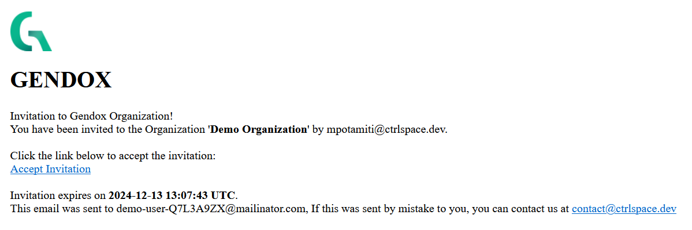

### Registration

When you click the Accept Invitation you will be directed to the Gendox login page. You will need to create an account on Gendox to proceed. To create a new account click on **Create an account**.

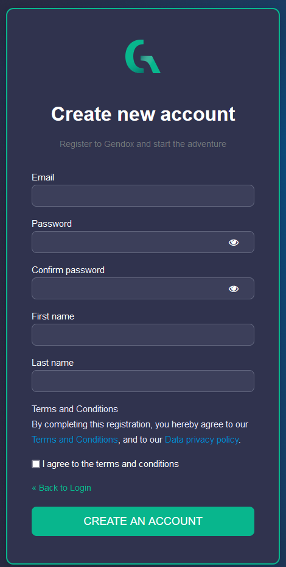

To register with gendox you will need to fill in:
- Your email address
- A password
- Your first name
- Your last name
- Accept the terms and conditions.
After filling in the necessary information click on **CREATE AN ACCOUNT**.

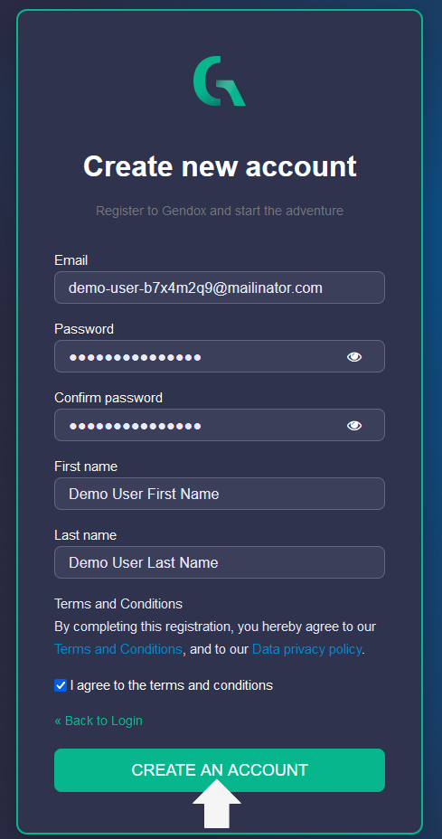

You will also be prompted to verify your email address to activate your account.

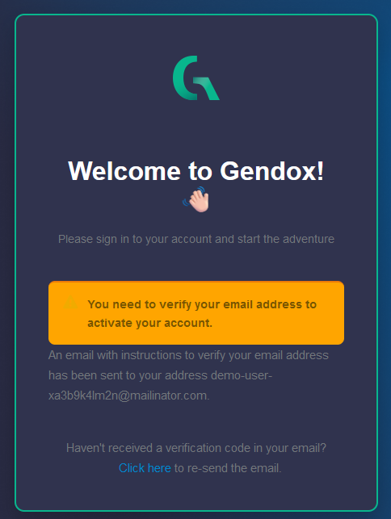

In your email inbox you receive see an email like the following:

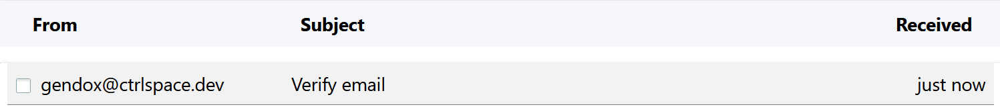

When you open it, you will see a link to verify your email. This will redirect you to the Gendox homepage.

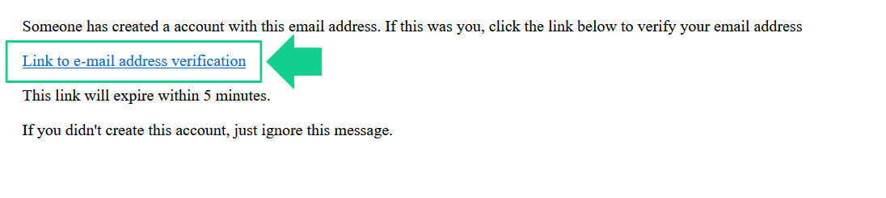

When you click on the link you will be logged to Gendox and you can now view the project you were invited to. Also, you can view the Gendox Homepage.

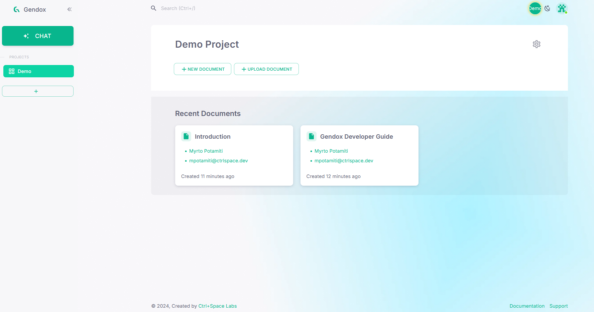

###  Multiple Project Invitations
It is important to note that an invitation is only valid for the project you are invited to the specific project not the whole organization. Hence, if you are invited to multiple projects you will need to repeat the process described above to become a member of all the projects. Otherwise, you will not be able to access them. 

###  Manual Registration

If you are not invited to join a project in gendox you will need to fill in you information to register as described in [here](#registration). In this case you will only need to verify your email. Also when you register a default project and organization is created for your user.

##  Getting Started with Gendox
###   Gendox Homepage

By observing the homepage, on the top right, you can view the organization you are in and the switch from dark to light mode. If you registered manually you will see the default organization and project that have been created for your project.

On the center of the page, you can see the current project you are in, and the documents contained in the current project.

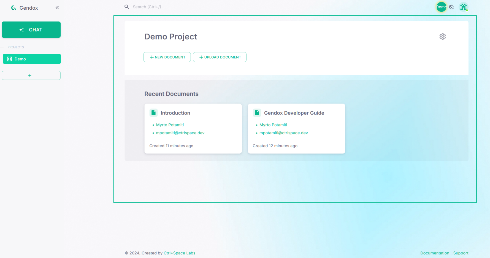

On the sidebar on the left, you can view the current organization’s projects and the chat button, to start chatting with AI agents. 

###   AI Agent Chat
When you click on chat you will be redirected to the chat menu. On the sidebar on the left,
you can view the current organization’s agents and under chats the chat threads you have
created.

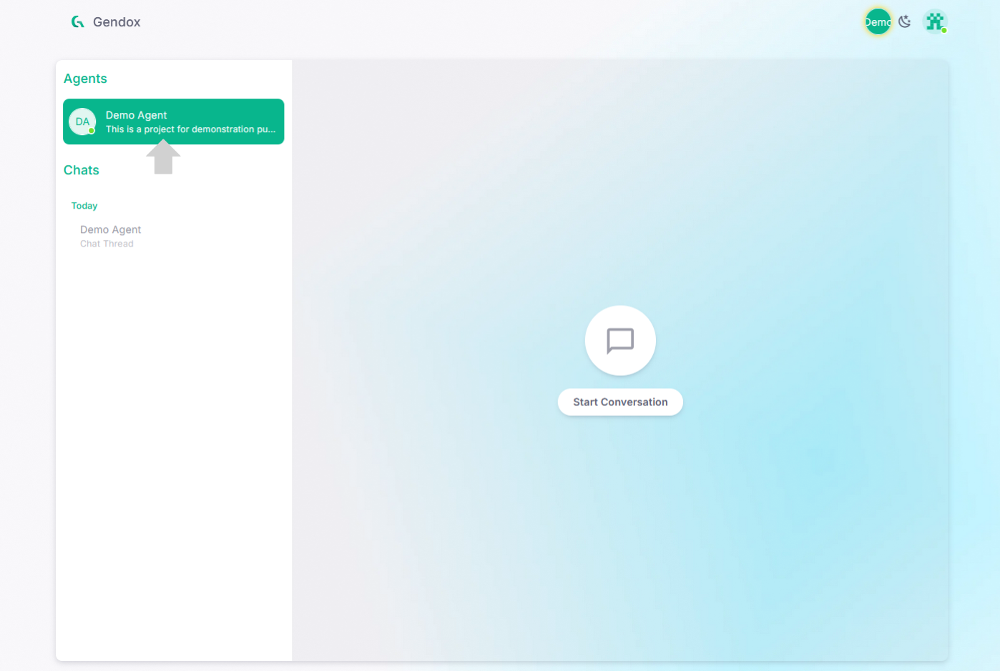

To start chatting with an AI agent select one by clicking on them. The chat menu will then
appear. You can write your message and send it by pressing **SEND**.

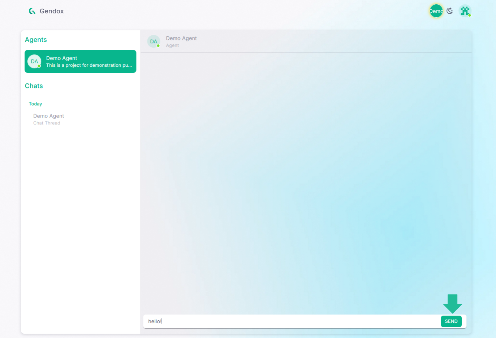

After the message is sent you will also see the AI agent’s answer.

The AI agent uses the project’s documents as it has been trained on them to answer. You
can view the documents that were used in forming the answer received by clicking on the
information tooltip.

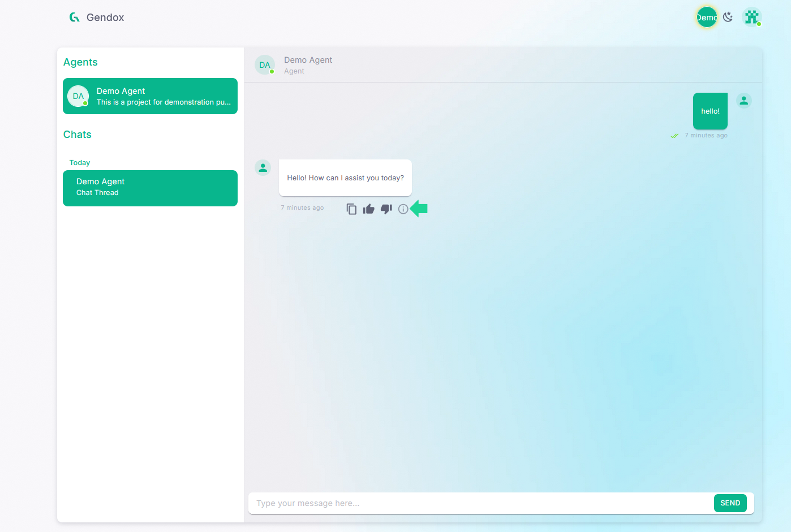

By pressing the button, you can now see the titles of the documents that were used. You
can also click on them. When you click on a document tittle a new tab opens with the
document.

You can now view the document. It is important to know that the document is in an internal
Gendox document, and not the original PDF document that was uploaded. Future Gendox
versions will also support viewing the original PDF document when you copen documents.

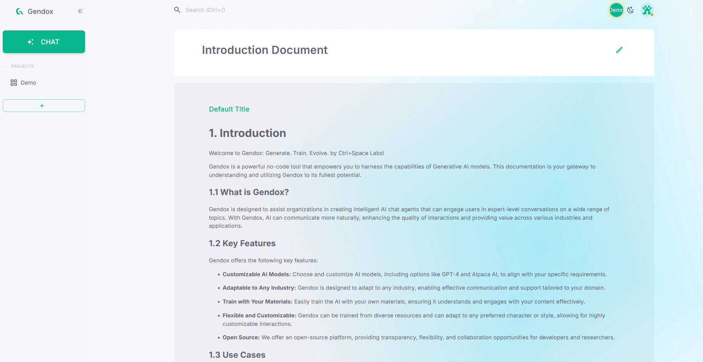
