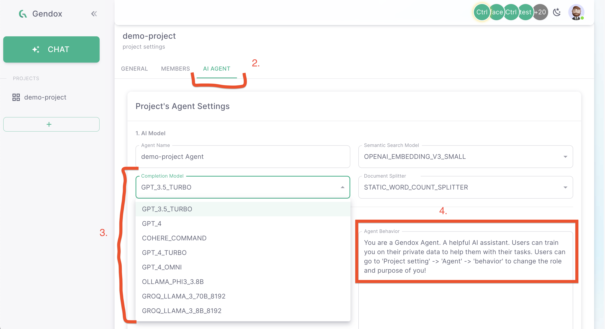

# Setup you first project

A Gendox Project is combining the 2 basic components of Gendox:
- AI Agents
- Data Pods

An AI Agent is a virtual assistant that can help you and it is trained in the data uploaded in the project's Data Pod.

## Create a new project

1. In the home page, click on the "+" button in the sidebar:

2. Fill in the project's name and description and click "SUBMIT":
3. In the sidebar click the project's name to enter the project's page

## Setup the AI Agent
An AI Agent is the combination of: 
- underlining LLM
- Role/Behavior
- Knowledge

To configure the Agent: 
1. Click on the Project Settings wheel button in the project's page:

2. Go To the Agent Tab
3. Select your preferred LLM 
4. Describe the agent Role in the `Agent Behavior` section

## Upload data

For the time being, Gendox supports only text files (.txt, .md etc). You can upload any text file you want to be used in the project.

1. In the project's page, click on the "Upload Documents" button:

2. Drag and drop the files you want to upload or click on the "Choose Files" button to select the files from your computer
3. Click "Upload" to upload the files

## Train the AI Agent

1. In the project's page, in the `General` tab click on the "Training" button

## Chat with the agent

1. In the project's page, in the sidebar, click on the "Chat" button
2. In the chat window select the Agent or the Chat thread that you want to continue the conversation
3. Chat!

