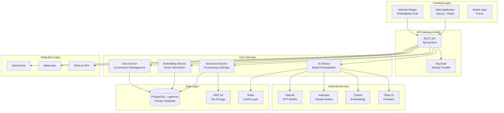
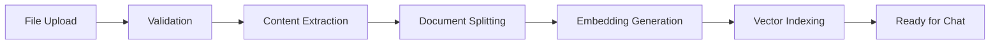
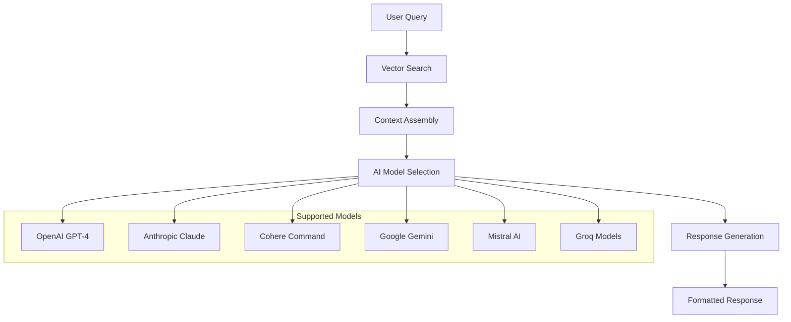
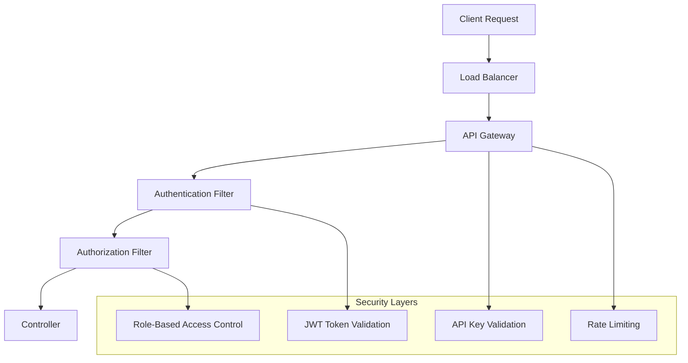
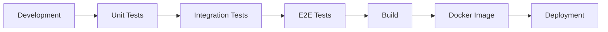

# Architecture Overview

Gendox follows a modern microservices architecture designed for scalability, maintainability, and extensibility. This document provides a comprehensive overview of the system architecture.

## High-Level Architecture



## Component Overview

### Frontend Components

#### 1. Web Application (gendox-frontend/)
- **Technology**: Next.js 15 + React 19
- **UI Framework**: Material-UI v5
- **State Management**: Redux Toolkit
- **Authentication**: OIDC Client
- **Features**:
  - User registration and login
  - Organization and project management
  - Document upload and management
  - AI agent configuration
  - Real-time chat interface
  - Administrative dashboards

#### 2. Website Widget
- **Technology**: Vanilla JavaScript
- **Deployment**: CDN-hosted embeddable script
- **Features**:
  - Easy integration into any website
  - Customizable chat interface
  - Real-time conversations
  - Mobile responsive

### Backend Components

#### 1. Core API (gendox-core-api/)
- **Technology**: Spring Boot 3.4 + Java 21
- **Architecture Pattern**: Domain-Driven Design
- **Security**: Spring Security + OAuth2/JWT
- **Database**: JPA + QueryDSL + PostgreSQL
- **Documentation**: OpenAPI 3 (Swagger)

**Key Packages:**
```
dev.ctrlspace.gendox.gendoxcoreapi/
├── controller/          # REST API endpoints
├── services/           # Business logic layer
├── repositories/       # Data access layer
├── model/             # JPA entities and DTOs
├── authentication/    # Security implementation
├── ai.engine/         # AI model integrations
├── spring.batch/      # Background job processing
├── integrations/      # External service integrations
└── utils/             # Utility classes
```

#### 2. Authentication Service (gendox-keycloak/)
- **Technology**: Keycloak 25.x
- **Features**:
  - OAuth2/OpenID Connect
  - Multi-tenant authentication
  - Role-based access control
  - Social login integration
  - API key management

### Data Layer

#### 1. Primary Database
- **Technology**: PostgreSQL 15 + pgvector extension
- **Purpose**: 
  - User and organization data
  - Document metadata
  - Chat conversations
  - Vector embeddings for semantic search
- **Schema Management**: Flyway migrations

#### 2. File Storage
- **Technology**: AWS S3 (configurable)
- **Purpose**:
  - Document file storage
  - Image and media assets
  - Backup and archival

#### 3. Cache Layer
- **Technology**: Redis (via Spring Cache with Caffeine)
- **Purpose**:
  - API response caching
  - Session management
  - Rate limiting counters

### Processing Services

#### 1. Document Processing Pipeline



**Technologies:**
- **PDF Processing**: Apache PDFBox + Spring AI
- **DOCX Processing**: docx4j
- **Text Processing**: Apache Commons Text
- **Splitting Strategies**: Static word count, token-based, page-based

#### 2. AI Model Orchestration



## Design Patterns

### 1. Service Layer Pattern
- **Services** contain business logic
- **Repositories** handle data access
- **Controllers** manage HTTP requests/responses

### 2. Domain-Driven Design
- Code organized around business domains
- Clear separation of concerns
- Rich domain models

### 3. Command Query Responsibility Segregation (CQRS)
- Separate read and write operations
- Optimized query handling with QueryDSL
- Event-driven architecture for async operations

### 4. Repository Pattern with Specifications
- Type-safe queries using QueryDSL
- Reusable query predicates
- Dynamic query building

### 5. Converter Pattern
- Separate DTOs from entities
- Clean API contracts
- Version-safe data transformation

## Security Architecture



### Security Features
- **JWT-based Authentication**: Stateless token validation
- **Multi-tenant Authorization**: Organization-level access control
- **API Key Management**: For programmatic access
- **Rate Limiting**: Request throttling per user/organization
- **Data Encryption**: At rest and in transit
- **Audit Logging**: Complete action tracking

## Scalability Considerations

### Horizontal Scaling
- **Stateless Services**: All services can be horizontally scaled
- **Database Sharding**: PostgreSQL read replicas
- **CDN Integration**: Static asset distribution
- **Load Balancing**: Multiple API instances

### Performance Optimizations
- **Connection Pooling**: HikariCP for database connections
- **Lazy Loading**: JPA lazy initialization
- **Caching Strategy**: Multi-level caching (L1: Caffeine, L2: Redis)
- **Async Processing**: Spring Batch for heavy operations

### Monitoring and Observability
- **Metrics**: Micrometer + Prometheus
- **Tracing**: Spring Boot Actuator
- **Health Checks**: Custom health indicators
- **Logging**: Structured logging with correlation IDs

## Development Workflow



### Testing Strategy
- **Unit Tests**: JUnit 5 + Mockito
- **Integration Tests**: TestContainers + Spring Boot Test
- **E2E Tests**: Playwright for full workflow testing
- **Load Testing**: JMeter for performance validation

### CI/CD Pipeline
- **Source Control**: Git with feature branches
- **Build Automation**: Maven for backend, npm for frontend
- **Containerization**: Docker multi-stage builds
- **Orchestration**: Docker Compose for local, Kubernetes for production

## Data Flow

### Document Processing Flow
1. **Upload**: Files uploaded via REST API
2. **Validation**: File type and size validation
3. **Storage**: Files stored in S3 with metadata in PostgreSQL
4. **Processing**: Background job extracts content
5. **Splitting**: Document split into semantic sections
6. **Embedding**: Vector embeddings generated for each section
7. **Indexing**: Embeddings stored in pgvector for similarity search

### Chat Flow
1. **Query**: User submits question via API
2. **Search**: Vector similarity search for relevant context
3. **Assembly**: Context assembled with conversation history
4. **Generation**: AI model generates response
5. **Storage**: Conversation stored in database
6. **Response**: Formatted response sent to client

## Configuration Management

### Environment-Specific Configuration
- **application.yml**: Base configuration
- **application-\{profile\}.yml**: Environment-specific overrides
- **Environment Variables**: Secrets and deployment-specific values

### Feature Flags
- Database-driven feature toggles
- A/B testing capabilities
- Gradual rollout support

## Next Steps

To dive deeper into specific areas:
- **Backend Development**: Explore the Spring Boot API in the `gendox-core-api/` directory
- **Frontend Development**: Check out the Next.js application in `gendox-frontend/` directory  
- **Database Setup**: See the [Installation Guide](../getting-started/installation) for database configuration
- **API Integration**: Review the [API Documentation](../api/overview) for endpoint details

## Contributing

Want to contribute to the architecture? Check out our:
- **Development Guidelines**: Visit the [Gendox GitHub Repository](https://github.com/ctrl-space-labs/gendox-core) for contribution guidelines
- **Community Discussions**: Join our [Discord Community](https://discord.gg/jWes2urauW) to discuss architecture decisions
- **Issue Tracking**: Report issues or suggest improvements on [GitHub Issues](https://github.com/ctrl-space-labs/gendox-core/issues)