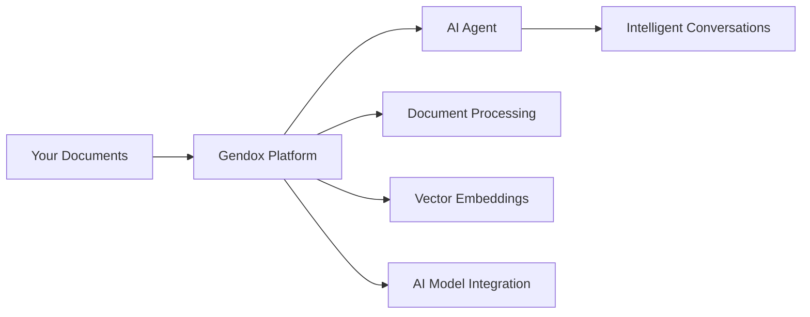

# Getting Started with Gendox

Welcome to Gendox! This comprehensive guide will walk you through creating your first intelligent AI agent from your documents in under 15 minutes. Whether you're a business user looking to create a customer support bot or a developer building advanced AI integrations, this guide will get you started quickly.

## What You'll Accomplish

By the end of this guide, you'll have:

1. ✅ Created your Gendox account with proper authentication
2. ✅ Set up your first organization with team management
3. ✅ Configured your first project with AI model selection
4. ✅ Uploaded and processed documents with semantic indexing
5. ✅ Trained your AI agent with custom instructions
6. ✅ Started conversing with your intelligent AI assistant
7. ✅ Explored integration options for deployment

## How Gendox Works

Gendox uses **Retrieval-Augmented Generation (RAG)** technology to create intelligent AI agents:

### 1. Document Processing 📄
Your documents are processed using advanced NLP techniques:
- **Text Extraction**: Content is extracted while preserving structure
- **Intelligent Chunking**: Documents are split into meaningful sections
- **Vector Embeddings**: Text is converted to mathematical representations
- **Semantic Indexing**: Content is indexed for fast, relevant retrieval

### 2. AI Agent Training 🤖
Your AI agent is configured with:
- **Model Selection**: Choose from GPT-4, Claude, Gemini, and more
- **Custom Instructions**: Define personality, tone, and behavior
- **Knowledge Base**: Your processed documents become the agent's knowledge
- **Context Management**: Relevant information is retrieved for each query

### 3. Intelligent Responses 💬
When users interact with your agent:
- **Query Analysis**: User questions are analyzed for intent and context
- **Semantic Search**: Relevant document sections are retrieved
- **Response Generation**: AI models generate contextual answers
- **Source Attribution**: Responses include references to source documents

## Gendox in 5 Minutes

Here's what Gendox does in simple terms:



1. **Upload your documents** (PDFs, Word docs, text files, markdown)
2. **Gendox processes them** into searchable knowledge using AI
3. **AI models use this knowledge** to answer questions accurately
4. **Users get intelligent responses** based on your specific content

## Use Cases & Examples

### 📞 **Customer Support Agent**
Transform your help documentation, FAQs, and support articles into an intelligent customer service agent that provides instant, accurate answers 24/7.

**Example**: A SaaS company uploads their API documentation, user guides, and troubleshooting articles to create an agent that helps developers integrate their platform.

### 📚 **Internal Knowledge Assistant** 
Turn your company's internal documentation, policies, and procedures into an AI assistant that helps employees find information quickly.

**Example**: An HR department creates an agent from employee handbooks, policies, and procedures to answer common HR questions instantly.

### 🎓 **Educational Tutor**
Create personalized tutoring agents from textbooks, course materials, and educational content.

**Example**: A university professor uploads course materials and creates an AI tutor that helps students understand complex concepts and answers questions outside office hours.

## Core Concepts

### Organizations
- Top-level entity for managing teams and resources
- Can contain multiple projects and users
- Billing and subscription management

### Projects
- Container for related documents and AI agents
- Each project has its own knowledge base
- Configurable AI model settings

### Documents
- Source materials that train your AI agent
- Automatically processed into searchable sections
- Support for various file formats

### AI Agents
- The conversational interface powered by your documents
- Configurable personality, temperature, and behavior
- Can be deployed across multiple channels

### Embeddings
- Vector representations of your document content
- Enable semantic search and retrieval
- Generated automatically during document processing

## Deployment Options

Gendox offers several deployment options to fit your needs:

### 🌐 Cloud Hosted (Recommended for getting started)
- Hosted at [app.gendox.dev](https://app.gendox.dev)
- No setup required
- Managed updates and maintenance

### 🐳 Docker Compose (Local development)
```bash
git clone https://github.com/ctrl-space-labs/gendox-core
cd gendox-core
docker-compose up
```

### ☁️ Cloud Deployment (Production)
- Deploy to AWS, GCP, Azure
- Full control over infrastructure
- Enterprise-grade scaling

### 🛠️ Source Code (Developers)
- Full source code access
- Custom modifications
- Contribute to the project

## Prerequisites Overview

Before you start, you'll need:

- **For Users**: Just a web browser and email address
- **For Local Development**: Docker and Docker Compose
- **For Source Development**: Java 21, Node.js 18+, PostgreSQL 15+

## Next Steps

Ready to dive in? Here's your path forward:

1. **[Check Prerequisites](prerequisites)** - Ensure you have what you need
2. **[Installation Guide](installation)** - Set up your environment
3. **[Quick Start](quick-start)** - Create your first AI agent

## Need Help?

- 💬 **Discord**: Join our [Discord community](https://discord.gg/jWes2urauW) for real-time support
- 📖 **Documentation**: Browse the comprehensive guides in this documentation
- 🐛 **Issues**: Report bugs on [GitHub Issues](https://github.com/ctrl-space-labs/gendox-core/issues)
- 📧 **Contact**: Reach out to [contact@ctrlspace.dev](mailto:contact@ctrlspace.dev)

Let's get started building your intelligent AI agent! 🚀